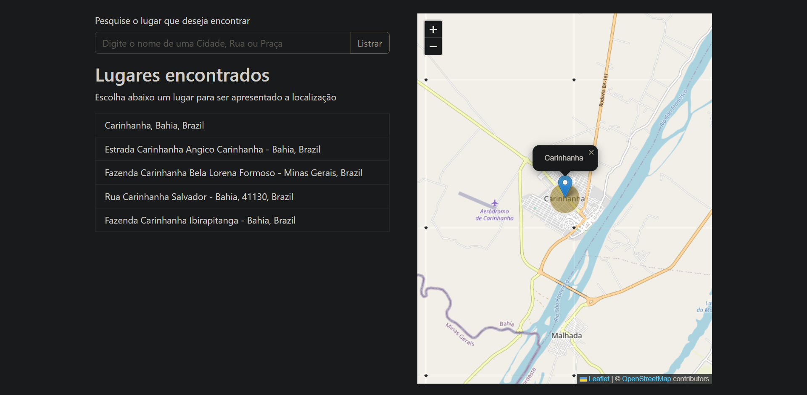

# Localizador de lugares

Localizador de lugares, basta inserir o nome da Rua, Praça ou Cidade que deseja encontrar que a API retornará nomes similares daquela busca, logo após, caso queira visualizar a localização pelo mapa e só clicar em cima do nome.

## Screenshots

## Criador

- [@joseantonion03](https://www.github.com/joseantonion03)

## Pilha de tecnologia

As seguintes ferramentas foram usadas na construção do projeto:

**Linguagens:** HTML, CSS, JavaScript

**Framework:** Booststrap

**Bibliotecas:** Leaflet, SweetAlert2

## Suporte

Para suporte, e-mail: ja2915588@gmail.com.

